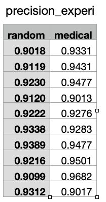
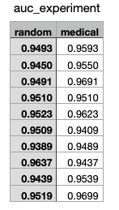

# Semantic similarity detection in medical field based on convolutional neural network

## Dependencies

Install dependencies via following script

```bash
pip install -r requirements.txt
```

## Data Download Instructions

This repo contains all necessary data. For pre-trained model we use, please download via this [link]() using Illinois account and move them into a folder called models in the notebook directory.

## Preprocessing Code

[Preprocessing notebook](https://github.com/liutiantian233/CNN4Medical/blob/main/data_processing.ipynb)

## Training and Evaluation Code

[Randomly Initialized Vector Model](https://github.com/liutiantian233/CNN4Medical/blob/main/random_vector_cnn_model.ipynb)

[Medical Concept Vector Model](https://github.com/liutiantian233/CNN4Medical/blob/main/medical_vector_cnn_model.ipynb)

## Table of results





## Citation to the Original Paper

Zheng, T., Gao, Y., Wang, F. *et al.* Detection of medical text semantic similarity based on convolutional neural network. *BMC Med Inform Decis Mak* **19,** 156 (2019). https://doi.org/10.1186/s12911-019-0880-2
